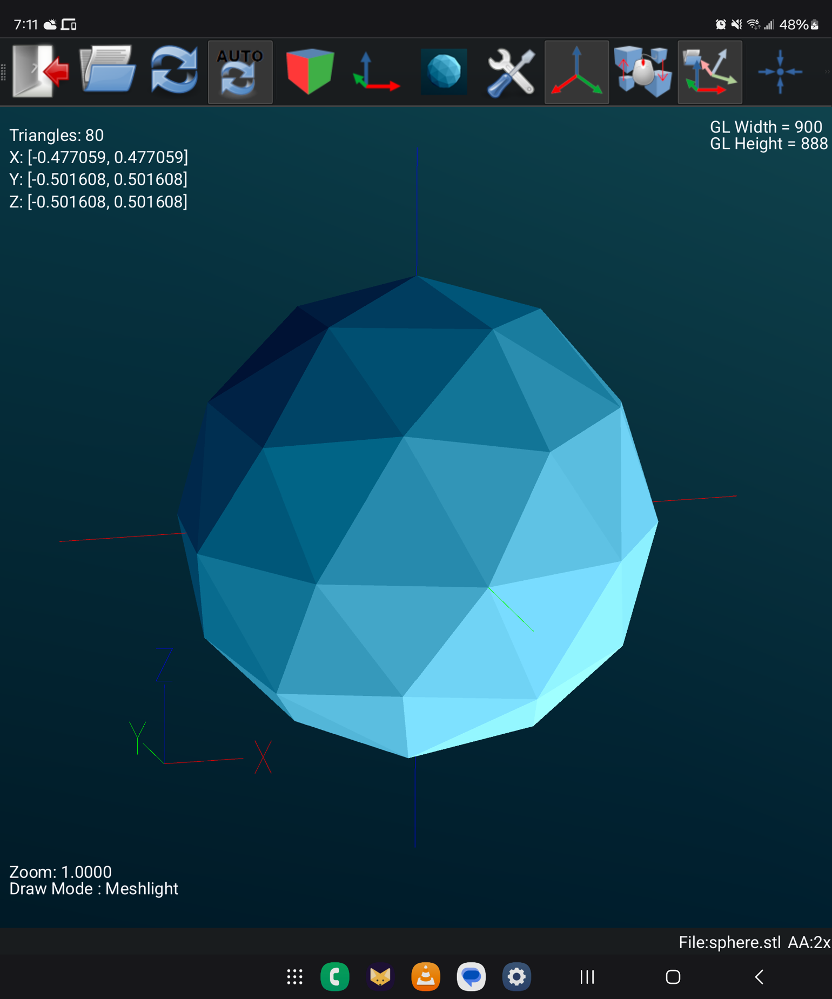

# fstl-e for Android
# fstl-e for Android

<p align="center"></p>


**Status: Alpha** - Core functionality working, but still in active development.

Android port of [fstl-e](https://github.com/wdaniau/fstl), a fast STL, 3MF, and STEP file viewer.

## Download

Direct APK (debug build):

- APK: dist/fstl-e-android-debug_20251125_191624.apk
- SHA-256: dist/fstl-e-android-debug_20251125_191624.apk.sha256

## Features

- Fast rendering of STL (binary and ASCII), 3MF, and STEP files
- Multiple draw modes: Shaded, Wireframe, Surface Angle, Meshlight
- Configurable lighting and shader preferences
- Touch gestures: pinch to zoom, drag to rotate
- Auto-reload on file changes
- Displays mesh information (triangle count, dimensions)
- Supports Android's scoped storage (content URIs)

## Building

Requires Qt 6.5+ for Android (tested with Qt 6.10).

```bash
mkdir build && cd build
cmake -DCMAKE_TOOLCHAIN_FILE=$QT_ROOT/android_arm64_v8a/lib/cmake/Qt6/qt.toolchain.cmake ..
cmake --build .
```

## License

MIT License - see LICENSE file

## Credits

- Original fstl: [Matt Keeter](https://github.com/fstl-app/fstl)
- fstl-e enhancements: [William Daniau](https://github.com/wdaniau/fstl)
- Android port: Prj-m and contributors
